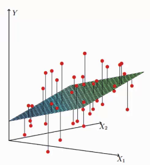
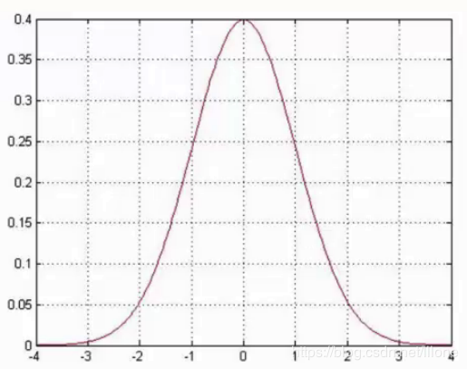

# Linear Regression

线性回归

## 最小二乘法

使用 $h\left(x\right)$ 作为预测值，假设线性函数定义如下：

$$
\begin{aligned}
h_\theta \left(x_{1},x_{2},\cdots x_{n}\right) &= \theta_{0} + \theta_{1}x_{1} + \theta_{2}x_{2} + \cdots + \theta_{n}x_{n}
\\
&= \theta_{0}x_{0} + \theta_{1}x_{1} + \theta_{2}x_{2} + \cdots + \theta_{n}x_{n} \\
&= \sum_{i=0}^n \theta_{i} x_{i}
\\
&=
\left[
    \begin{matrix}
    \theta_{0} & \theta_{1} & \theta_{2} & ... & \theta_{n}
    \end{matrix}
\right]
\left[
    \begin{matrix}
    x_{0} \\
    x_{1} \\
    x_{2} \\
    ... \\
    x_{n}
    \end{matrix}
\right]
\\
&= \Theta^{T}X
\end{aligned}
$$

其中 $\theta_{0}$ 是偏置，可以看成是 $\theta_{0}x_{0}$ ($x_{0} = 1$)。最终得到如下函数：

$$
h_\theta \left(X\right) = \Theta^{T} X \tag {1}
$$

矩阵形式 $\Theta^{T} X$ 中的 $\Theta$ 和 $X$ 分别为：

$$
\begin{aligned}
\Theta &=
\left[
    \begin{matrix}
    \theta_{0} \\
    \theta_{1} \\
    \theta_{2} \\
    ... \\
    \theta_{n}
    \end{matrix}
\right]
=
\left[
    \begin{matrix}
    \theta_{0} & \theta_{1} & \theta_{2} & ... & \theta_{n}
    \end{matrix}
\right]^T
\\
X &=
\left[
    \begin{matrix}
    x_{0} \\
    x_{1} \\
    x_{2} \\
    \cdots \\
    x_{n}
    \end{matrix}
\right]
=
\left[
    \begin{matrix}
    x_{0} & x_{1} & x_{2} & ... & x_{n}
    \end{matrix}
\right]^T
\end{aligned}
$$

真实值与预测值之间一定存在误差(用 $\epsilon$ 来表示误差)，用以下函数表示：

$$
y^{\left(i\right)} = \Theta^{T} x^{\left(i\right)} + \epsilon^{\left(i\right)} \tag{2}
$$

其中： $y^{\left(i\right)}$ 为真实值, $\Theta^{T} x^{\left(i\right)}$ 为预测值，$\Theta^{T}$ 为参数矩阵, $x^{\left(i\right)}$ 为第 $i$ 条数据的特征矩阵, $\epsilon^{\left(i\right)}$ 为第 $i$ 条数据所产生的误差。假设只有两个特征，显示如图（红色的点表示真实值, 垂线与平面交点为预测值，高度差代表误差）：

误差 $\epsilon^{\left(i\right)}$ 是独立并且具有相同的分布，通常认为服从均值为 0 方差为 $\theta^2$ 的高斯分布。

* 独立： 每个样本之间是独立的，互相不影响。
* 相同分布：就是每次抽样,样本都服从同样的一个分布。
* 均值为0：均值要么多一点儿，要么少一点儿，不应该一直多或者一直少，均值应该趋近于 0 。
* 高斯分布： 在高斯分布中, 越靠近0的位置, 产生的偏差越小, 出现的概率就越大; 越远离0的位置, 产生的偏差越  大, 出现的概率就越小。

上图为高斯分布图。由于误差服从高斯分布，则：

$$
p\left( \epsilon^{\left(i\right)} \right)
= \frac {1} {2 \pi \sigma} exp \left( - \frac {\left( \epsilon^{\left(i\right)} \right)^2} {2 \sigma^2} \right) \tag {3}
$$

将 (2) 式子 $\epsilon^{\left(i\right)} = y^{\left(i\right)} - \Theta^{T} x^{\left(i\right)}$ 带入到 (3) 中，得到如下：

$$
p\left( y^{\left(i\right)} \vert x^{\left(i\right)} ;\Theta \right)
= \frac {1} {2 \pi \sigma} exp \left( - \frac {\left( y^{\left(i\right)} - \Theta^{T} x^{\left(i\right)} \right)^2} {2 \sigma^2} \right) \tag {4}
$$

上面 (4) 式子中 $p\left( y^{\left(i\right)} \vert x^{\left(i\right)} ;\Theta \right)$ 表示什么样的 $\Theta$ 参数跟 $x^{\left(i\right)}$ 组合，使得越接近 $y^{\left(i\right)}$ (真实值) 的概率值越大。

似然函数：似然函数是根据样本去估计参数的值的一个函数, 即是由数据去计算参数, 使得参数和我们的数据组合后更接近真实值。如下：

$$
\begin{aligned}
L\left(\Theta \right)
&= \prod_{i=1}^{m} p\left( y^{\left(i\right)} \vert x^{\left(i\right)} ;\Theta \right) \\
&= \prod_{i=1}^{m} \frac {1} {2 \pi \sigma} exp \left( - \frac {\left( y^{\left(i\right)} - \Theta^{T} x^{\left(i\right)} \right)^2} {2 \sigma^2} \right)
\end{aligned}
$$

这里使用的是累乘，对于所有的样本（ $m$ 表示样本数 ）来说，都要使得当前这组参数 $x^{\left(i\right)}$ 跟 $\Theta$ 组合的最终效果是最好的，也就是预测值和真实值相等的概率是最大的。我们希望 $L\left(\Theta \right)$ 的值越大越好。

累乘求极值难度大，这里求对数转换为累加（$\log{AB} = \log{A} \log{B}$） 。转换如下：

$$
\begin{aligned}
l\left(\Theta \right)
&= \log L\left(\Theta \right) \\
&= \log \prod_{i=1}^{m} {\frac {1} {2 \pi \sigma} exp \left( - \frac {\left( y^{\left(i\right)} - \Theta^{T} x^{\left(i\right)} \right)^2} {2 \sigma^2} \right)} \\
&= \sum_{i=1}^{m} {\log \frac {1} {2 \pi \sigma} exp \left( - \frac {\left( y^{\left(i\right)} - \Theta^{T} x^{\left(i\right)} \right)^2} {2 \sigma^2} \right)} \\
&= \sum_{i=1}^{m} {\left( \log {\frac {1} {2 \pi \sigma}} + \log {exp \left( - \frac {\left( y^{\left(i\right)} - \Theta^{T} x^{\left(i\right)} \right)^2} {2 \sigma^2} \right)} \right) }\\
&= m \log {\frac {1} {2 \pi \sigma}} - {\frac {1} {\sigma^2}} \cdot {\frac {1} {2}} \sum_{i=1}^{m} {\left( y^{\left(i\right)} - \Theta^{T} x^{\left(i\right)} \right)^2}
\end{aligned}
$$

极大似然估计：即 $L\left(\Theta \right)$ 越大越好，也就是 $l\left(\Theta \right) = \log L\left(\Theta \right)$ 越大越好。

$$
\begin{aligned}
& \because \left( y^{\left(i\right)} - \Theta^{T} x^{\left(i\right)} \right)^2 & > 0 \\
& \therefore {\frac {1} {\sigma^2}} \cdot {\frac {1} {2}} \sum_{i=1}^{m} {\left( y^{\left(i\right)} - \Theta^{T} x^{\left(i\right)} \right)^2} & > 0 \\
& \because m \log {\frac {1} {2 \pi \sigma}} & > 0 \quad \text {且为定值}\\
& \text {要想} l\left(\Theta \right) = \log L\left(\Theta \right) \quad \text {越大越好} \\
& \text {则} {\frac {1} {\sigma^2}} \cdot {\frac {1} {2}} \sum_{i=1}^{m} {\left( y^{\left(i\right)} - \Theta^{T} x^{\left(i\right)} \right)^2} \quad \text {越小越好} \\
& \because {\frac {1} {\sigma^2}} \quad 为定值 \\
& \therefore {\frac {1} {2}} \sum_{i=1}^{m} {\left( y^{\left(i\right)} - \Theta^{T} x^{\left(i\right)} \right)^2} \quad \text {越小越好} \quad \text {这里留着} \frac {1} {2} \text {是为了后面求导约掉} \\
\end{aligned}
$$

经过上面的分析，知道了我们的目标函数，然后再将 (1) 带入，再转为矩阵形式：

$$
\begin{aligned}
J\left(\Theta \right)
&= {\frac {1} {2}} \sum_{i=1}^{m} {\left( y^{\left(i\right)} - \Theta^{T} x^{\left(i\right)} \right)^2} \\
&= {\frac {1} {2}} \sum_{i=1}^{m} {\left( h_\theta \left( x^{\left(i\right)}\right) - y^{\left(i\right)} \right)^2} \\
&= {\frac {1} {2}} \left( X\Theta - Y\right)^T\left( X\Theta - Y\right)
\end{aligned}
$$

求目标函数对 $\Theta$ 偏导：

矩阵求导可以参考： [Wiki Matrix_calculus](https://en.wikipedia.org/wiki/Matrix_calculus)

$$
\begin{aligned}
\Delta_{\Theta}{J\left(\Theta \right)}
&= \Delta_{\Theta} \left( {\frac {1} {2}} \left( X\Theta - Y\right)^T\left( X\Theta - Y\right) \right) \\
&= \Delta_{\Theta} \left( {\frac {1} {2}} \left( \Theta^T X^T - Y^T\right)\left( X\Theta - Y\right) \right) \\
&= \Delta_{\Theta} \left( {\frac {1} {2}} \left( \Theta^T X^T X \Theta - \Theta^T X^T Y - Y^T \Theta X + Y^T Y\right) \right) \\
&= {\frac {1} {2}} \left( 2 X^T X \Theta - X^T Y - {\left(Y^T X \right)}^T \right) \\
&= {\frac {1} {2}} \left( 2 X^T X \Theta - X^T Y - X^T Y \right) \\
&= X^T X \Theta - X^T Y
\end{aligned}
$$

令偏导等于 0 ，即： $X^T X \Theta - X^T Y = 0$

两边都乘以 $\left(X^T X\right)^{-1}$ 算出

$$
\Theta =\left(X^T X\right)^{-1} X^T Y \tag {5}
$$

到这里也就算出来了 $\Theta$ ，实现在代码中。
