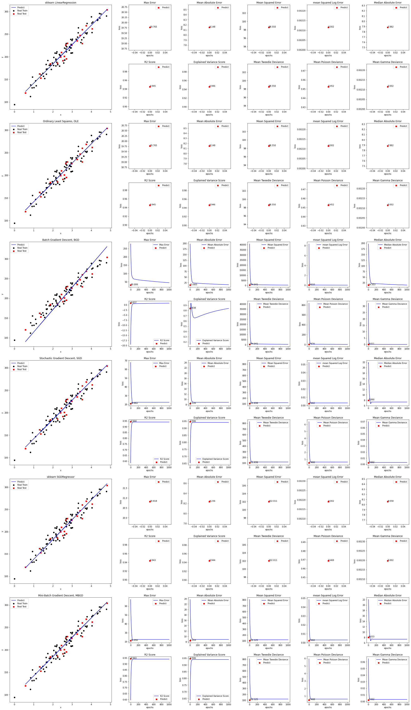

# Linear Regression

线性回归

## 普通最小二乘法（Ordinary Least Squares, OLE)

使用 $h\left(x\right)$ 作为预测值，假设线性函数定义如下：

$$
\begin{aligned}
h_\theta \left(x_{1},x_{2},\cdots x_{n}\right) &= \theta_{0} + \theta_{1}x_{1} + \theta_{2}x_{2} + \cdots + \theta_{n}x_{n}
\\
&= \theta_{0}x_{0} + \theta_{1}x_{1} + \theta_{2}x_{2} + \cdots + \theta_{n}x_{n} \\
&= \sum_{i=0}^n \theta_{i} x_{i}
\\
&=
\left[
    \begin{matrix}
    \theta_{0} & \theta_{1} & \theta_{2} & \cdots & \theta_{n}
    \end{matrix}
\right]
\left[
    \begin{matrix}
    x_{0} \\
    x_{1} \\
    x_{2} \\
    \cdots \\
    x_{n}
    \end{matrix}
\right]
\\
&= \Theta^{T}X
\end{aligned}
$$

其中 $\theta_{0}$ 是偏置项，可以看成是 $\theta_{0}x_{0}$ ($x_{0} = 1$)。最终得到如下函数：

$$
h_\theta \left(X\right) = \Theta^{T} X \tag {1}
$$

矩阵形式 $\Theta^{T} X$ 中的 $\Theta$ 和 $X$ 分别为：

$$
\begin{aligned}
\Theta &=
\left[
    \begin{matrix}
    \theta_{0} \\
    \theta_{1} \\
    \theta_{2} \\
    \cdots \\
    \theta_{n}
    \end{matrix}
\right]
=
\left[
    \begin{matrix}
    \theta_{0} & \theta_{1} & \theta_{2} & \cdots & \theta_{n}
    \end{matrix}
\right]^T
\\
X &=
\left[
    \begin{matrix}
    x_{0} \\
    x_{1} \\
    x_{2} \\
    \cdots \\
    x_{n}
    \end{matrix}
\right]
=
\left[
    \begin{matrix}
    x_{0} & x_{1} & x_{2} & \cdots & x_{n}
    \end{matrix}
\right]^T
\end{aligned}
$$

真实值与预测值之间一定存在误差(用 $\epsilon$ 来表示误差)，用以下函数表示：

$$
y^{\left(i\right)} = \Theta^{T} x^{\left(i\right)} + \epsilon^{\left(i\right)} \tag{2}
$$

其中： $y^{\left(i\right)}$ 为真实值, $\Theta^{T} x^{\left(i\right)}$ 为预测值，$\Theta^{T}$ 为参数矩阵, $x^{\left(i\right)}$ 为第 $i$ 条数据的特征矩阵, $\epsilon^{\left(i\right)}$ 为第 $i$ 条数据所产生的误差。假设只有两个特征，显示如图（红色的点表示真实值, 垂线与平面交点为预测值，高度差代表误差）：

误差 $\epsilon^{\left(i\right)}$ 是独立并且具有相同的分布，通常认为服从均值为 0 方差为 $\theta^2$ 的高斯分布。

* 独立： 每个样本之间是独立的，互相不影响。
* 相同分布：就是每次抽样,样本都服从同样的一个分布。
* 均值为0：均值要么多一点儿，要么少一点儿，不应该一直多或者一直少，均值应该趋近于 0 。
* 高斯分布： 在高斯分布中, 越靠近0的位置, 产生的偏差越小, 出现的概率就越大; 越远离0的位置, 产生的偏差越  大, 出现的概率就越小。

上图为高斯分布图。由于误差服从高斯分布，则：

$$
p\left( \epsilon^{\left(i\right)} \right)
= \frac {1} {2 \pi \sigma} exp \left( - \frac {\left( \epsilon^{\left(i\right)} \right)^2} {2 \sigma^2} \right) \tag {3}
$$

将 (2) 式子 $\epsilon^{\left(i\right)} = y^{\left(i\right)} - \Theta^{T} x^{\left(i\right)}$ 带入到 (3) 中，得到如下：

$$
p\left( y^{\left(i\right)} \vert x^{\left(i\right)} ;\Theta \right)
= \frac {1} {2 \pi \sigma} exp \left( - \frac {\left( y^{\left(i\right)} - \Theta^{T} x^{\left(i\right)} \right)^2} {2 \sigma^2} \right) \tag {4}
$$

上面 (4) 式子中 $p\left( y^{\left(i\right)} \vert x^{\left(i\right)} ;\Theta \right)$ 表示什么样的 $\Theta$ 参数跟 $x^{\left(i\right)}$ 组合，使得越接近 $y^{\left(i\right)}$ (真实值) 的概率值越大。

似然函数：似然函数是根据样本去估计参数的值的一个函数, 即是由数据去计算参数, 使得参数和我们的数据组合后更接近真实值。如下：

$$
\begin{aligned}
L\left(\Theta \right)
&= \prod_{i=1}^{m} p\left( y^{\left(i\right)} \vert x^{\left(i\right)} ;\Theta \right) \\
&= \prod_{i=1}^{m} \frac {1} {2 \pi \sigma} exp \left( - \frac {\left( y^{\left(i\right)} - \Theta^{T} x^{\left(i\right)} \right)^2} {2 \sigma^2} \right)
\end{aligned}
$$

这里使用的是累乘，对于所有的样本（ $m$ 表示样本数 ）来说，都要使得当前这组参数 $x^{\left(i\right)}$ 跟 $\Theta$ 组合的最终效果是最好的，也就是预测值和真实值相等的概率是最大的。我们希望 $L\left(\Theta \right)$ 的值越大越好。

累乘求极值难度大，这里求对数转换为累加（$\log{AB} = \log{A} \log{B}$） 。转换如下：

$$
\begin{aligned}
l\left(\Theta \right)
&= \log L\left(\Theta \right) \\
&= \log \prod_{i=1}^{m} {\frac {1} {2 \pi \sigma} exp \left( - \frac {\left( y^{\left(i\right)} - \Theta^{T} x^{\left(i\right)} \right)^2} {2 \sigma^2} \right)} \\
&= \sum_{i=1}^{m} {\log \frac {1} {2 \pi \sigma} exp \left( - \frac {\left( y^{\left(i\right)} - \Theta^{T} x^{\left(i\right)} \right)^2} {2 \sigma^2} \right)} \\
&= \sum_{i=1}^{m} {\left( \log {\frac {1} {2 \pi \sigma}} + \log {exp \left( - \frac {\left( y^{\left(i\right)} - \Theta^{T} x^{\left(i\right)} \right)^2} {2 \sigma^2} \right)} \right) }\\
&= m \log {\frac {1} {2 \pi \sigma}} - {\frac {1} {\sigma^2}} \cdot {\frac {1} {2}} \sum_{i=1}^{m} {\left( y^{\left(i\right)} - \Theta^{T} x^{\left(i\right)} \right)^2}
\end{aligned}
$$

极大似然估计：即 $L\left(\Theta \right)$ 越大越好，也就是 $l\left(\Theta \right) = \log L\left(\Theta \right)$ 越大越好。

$$
\begin{aligned}
& \because \left( y^{\left(i\right)} - \Theta^{T} x^{\left(i\right)} \right)^2 & > 0 \\
& \therefore {\frac {1} {\sigma^2}} \cdot {\frac {1} {2}} \sum_{i=1}^{m} {\left( y^{\left(i\right)} - \Theta^{T} x^{\left(i\right)} \right)^2} & > 0 \\
& \because m \log {\frac {1} {2 \pi \sigma}} & > 0 \quad \text {且为定值}\\
& \text {要想} l\left(\Theta \right) = \log L\left(\Theta \right) \quad \text {越大越好} \\
& \text {则} {\frac {1} {\sigma^2}} \cdot {\frac {1} {2}} \sum_{i=1}^{m} {\left( y^{\left(i\right)} - \Theta^{T} x^{\left(i\right)} \right)^2} \quad \text {越小越好} \\
& \because {\frac {1} {\sigma^2}} \quad 为定值 \\
& \therefore {\frac {1} {2}} \sum_{i=1}^{m} {\left( y^{\left(i\right)} - \Theta^{T} x^{\left(i\right)} \right)^2} \quad \text {越小越好} \quad \text {这里留着} \frac {1} {2} \text {是为了后面求导约掉} \\
\end{aligned}
$$

经过上面的分析，知道了我们的目标函数，然后再将 (1) 带入，再转为矩阵形式：

$$
\begin{aligned}
J\left(\Theta \right)
&= {\frac {1} {2}} \sum_{i=1}^{m} {\left( y^{\left(i\right)} - \Theta^{T} x^{\left(i\right)} \right)^2} \\
&= {\frac {1} {2}} \sum_{i=1}^{m} {\left( h_\theta \left( x^{\left(i\right)}\right) - y^{\left(i\right)} \right)^2} \\
&= {\frac {1} {2}} \left( X\Theta - Y\right)^T\left( X\Theta - Y\right)
\end{aligned}
$$

求目标函数对 $\Theta$ 偏导：

矩阵求导可以参考： [Wiki Matrix_calculus](https://en.wikipedia.org/wiki/Matrix_calculus)

$$
\begin{aligned}
\Delta_{\Theta}{J\left(\Theta \right)}
&= \Delta_{\Theta} \left( {\frac {1} {2}} \left( X\Theta - Y\right)^T\left( X\Theta - Y\right) \right) \\
&= \Delta_{\Theta} \left( {\frac {1} {2}} \left( \Theta^T X^T - Y^T\right)\left( X\Theta - Y\right) \right) \\
&= \Delta_{\Theta} \left( {\frac {1} {2}} \left( \Theta^T X^T X \Theta - \Theta^T X^T Y - Y^T \Theta X + Y^T Y\right) \right) \\
&= {\frac {1} {2}} \left( 2 X^T X \Theta - X^T Y - {\left(Y^T X \right)}^T \right) \\
&= {\frac {1} {2}} \left( 2 X^T X \Theta - X^T Y - X^T Y \right) \\
&= X^T X \Theta - X^T Y
\end{aligned}
$$

令偏导等于 0 ，即： $X^T X \Theta - X^T Y = 0$

两边都乘以 $\left(X^T X\right)^{-1}$ 算出

$$
\Theta =\left(X^T X\right)^{-1} X^T Y \tag {5}
$$

到这里也就算出来了 $\Theta$ ，实现在代码中。

* 优点：
  - 不需要迭代，不需要学习率
  - 可以得到全局最优解

* 缺点：
  - 需要计算 $\left(X^T X\right)^{-1}$ ，$X$ 必须是满秩矩阵，不是满秩就不能求逆，就无法使用了，可以采取一些方法来处理数据
  - - 当样本数 $m$ 小于特征数目 $n$ 的时候，$\left(X^T X\right)^{-1}$ 不可逆，可以增加样本数量
    - 存在一个特征与另一个特征线性相关或一个特征与若干个特征线性相关时，$\left(X^T X\right)^{-1}$ 也是不可逆的，筛选出线性无关的特征，不保留相同的特征，保证不存在线性相关的特征。
    - 采用正则化的方法。对于正则化的方法，常见的是L1正则项和L2正则项。
  - 当样本特征 $m$ 非常的大的时候，计算 $\left(X^T X\right)^{-1}$ 的逆矩阵非常耗时，时间复杂度 $O(n^3)$ ，小于 10000 是还可以接受
  - 只适用于线性模型

## 梯度下降 Radient Descent, RD)

梯度下降算法比较多，这里简单的推理几个。

先理解几个值：

单个样本的误差为： $\vert h_\theta \left( x^{\left(i\right)} \right) - y^{\left(i\right)} \vert$

单个样本的误差平方为：$\left( h_\theta \left( x^{\left(i\right)} \right) - y^{\left(i\right)} \right)^2$ ，我们使用平方是因为绝对值不好算。

### 批量梯度下降（Batch Gradient Descent, BGD）

批量梯度下降，它是指在每一次迭代时使用所有样本来进行梯度的更新。

目标函数为：

$$
J\left(\theta_{0}, \theta_{1}, \theta_{2}, \cdots \theta_{n} \right) = {\frac {1} {2m}} \sum_{i=1}^{m} {\left( h_\theta \left( x^{\left(i\right)} \right) - y^{\left(i\right)} \right)^2}
$$

其中 $h_\theta \left( x^{\left(i\right)} \right)$ 是预测值， $y^{\left(i\right)}$ 是真实值， $\sum_{i=1}^{m}$ 表示计算每一个样本，$\theta_{0}, \theta_{1}, \theta_{2}, \cdots \theta_{n}$ 表示特征系数，这里的 $\frac {1} {m}$ 表示对所有的样本求平均(对于每一个特征$\theta_j$)， $\frac {1} {2}$ 是为了方便后面的计算，求导后约掉。

那么我们的目标是：$\underset {\theta_{0}, \theta_{1}, \theta_{2}, \cdots \theta_{n}} {minimize} J\left( \theta_{0}, \theta_{1}, \theta_{2}, \cdots \theta_{n} \right)$ ，也就是选择 $\theta_{0}, \theta_{1}, \theta_{2}, \cdots \theta_{n}$ 使得 $J\left(\theta_{0}, \theta_{1}, \theta_{2}, \cdots \theta_{n} \right)$ 的值越小越好。然后代价函数对于每一个 $\theta_j$ (表示每一个特征) 求导：

$$
\begin{aligned}
\frac {\Delta J\left(\theta_{0}, \theta_{1}, \theta_{2}, \cdots \theta_{n} \right)} {\Delta \theta_j}
&= \frac {\Delta \left( {\frac {1} {2m}} \sum_{i=1}^{m} {\left( h_\theta \left( x^{\left(i\right)} \right) - y^{\left(i\right)} \right)^2} \right) } {\Delta \theta_j} \\
&= {\frac {1} {m}} \sum_{i=1}^{m} {\left( h_\theta \left( x^{\left(i\right)} \right) - y^{\left(i\right)} \right) x_{j}^{\left(i\right)}}
\end{aligned}
$$

每次迭代，对参数进行更新：

$$
\begin{aligned}
\theta_j \coloneqq \theta_j - \alpha {\frac {1} {m}} \sum_{i=1}^{m} {\left( h_\theta \left( x^{\left(i\right)} \right) - y^{\left(i\right)} \right) x_{j}^{\left(i\right)}}
\end{aligned}
$$

伪代码形式为：

$$
\begin{aligned}
& repeat \{ \\ &
& & \theta_j \coloneqq \theta_j - \alpha {\frac {1} {m}} \sum_{i=1}^{m} {\left( h_\theta \left( x^{\left(i\right)} \right) - y^{\left(i\right)} \right) x_{j}^{\left(i\right)}}  \;\;\;\; \left( for \;\; j = 0, 1, 2 \cdots n\right) \\
&\} & \\
\end{aligned}
$$

其中的 $\alpha$ 为学习率， $m$ 为样本个数， $i$ 为第$i$个样本， $n$ 为特征数，$j$ 为第 $j$ 个特征。

* 优点
  - 一次迭代是对所有样本进行计算，此时利用矩阵进行操作，实现了并行。
  - 由全数据集确定的方向能够更好地代表样本总体，从而更准确地朝向极值所在的方向。当目标函数为凸函数时，BGD一定能够得到全局最优。
* 缺点
  - 当样本数 $m$ 很大时，每迭代一步都需要对所有样本计算，训练过程会很慢。

### 随机梯度下降（Stochastic Gradient Descent, SGD）

随机梯度下降法不同于批量梯度下降，随机梯度下降是每次迭代使用一个样本来对参数进行更新，使得训练速度加快。

目标函数为：

$$
J^{\left(i\right)}\left(\theta_{0}, \theta_{1}, \theta_{2}, \cdots \theta_{n} \right) = {\frac {1} {2}} {\left( h_\theta \left( x^{\left(i\right)} \right) - y^{\left(i\right)} \right)^2}
$$

这里跟批量梯度下降差不多，只是不再使用所有的样本来计算并取平均值，而是采用 `1` 个，$\frac {1} {2}$ 是为了方便后面的计算，求导后约掉。对目标函数求导：

$$
\begin{aligned}
\frac {\Delta J^{\left(i\right)}\left(\theta_{0}, \theta_{1}, \theta_{2}, \cdots \theta_{n} \right)} {\Delta \theta_j}
&= \frac {\Delta \left( {\frac {1} {2}} {\left( h_\theta \left( x^{\left(i\right)} \right) - y^{\left(i\right)} \right)^2} \right) } {\Delta \theta_j} \\
&= {\left( h_\theta \left( x^{\left(i\right)} \right) - y^{\left(i\right)} \right) x_{j}^{\left(i\right)}}
\end{aligned}
$$

每次迭代，对参数进行更新：

$$
\theta_j \coloneqq \theta_j - \alpha {\left( h_\theta \left( x^{\left(i\right)} \right) - y^{\left(i\right)} \right) x_{j}^{\left(i\right)}}
$$

伪代码形式为（注意，这里不再有求和符号）：

$$
\begin{aligned}
& repeat \{ & & \\
& & for \;\;  & i = 1,2,3 \cdots m \;\; \{ \\
& & & {\theta_j \coloneqq \theta_j - \alpha {\left( h_\theta \left( x^{\left(i\right)} \right) - y^{\left(i\right)} \right) x_{j}^{\left(i\right)}}  \;\;\;\; \left( for \;\; j = 0, 1, 2 \cdots n\right)} \\
& & \} &\\
& \} & & \\
\end{aligned}
$$

其中的 $\alpha$ 为学习率， $m$ 为样本个数， $i$ 为第$i$个样本， $n$ 为特征数，$j$ 为第 $j$ 个特征。

* 优点
  - 由于不是在全部训练数据上的损失函数，而是在每轮迭代中，随机优化某一条训练数据上的损失函数，这样每一轮参数的更新速度大大加快。
* 缺点
  - 准确度下降。由于即使在目标函数为强凸函数的情况下，仍旧无法做到线性收敛。
  - 可能会收敛到局部最优，由于单个样本并不能代表全体样本的趋势。

### 小批量梯度下降（Mini-Batch Gradient Descent, MBGD）

小批量梯度下降，是对批量梯度下降以及随机梯度下降的一个折中办法。其思想是：每次迭代 使用 `batch_size` 个样本来对参数进行更新。

目标函数为：

$$
J^{\left(i\right)}\left(\theta_{0}, \theta_{1}, \theta_{2}, \cdots \theta_{n} \right) = {\frac {1} {2batch\_size}} \sum_{i=1}^{i+batch\_size-1} {\left( h_\theta \left( x^{\left(i\right)} \right) - y^{\left(i\right)} \right)^2}
$$

这里跟批量梯度下降差不多，只是不再使用所有的样本来计算并取平均值，而是采用 `batch_size` 个，$\frac {1} {2}$ 是为了方便后面的计算，求导后约掉。对目标函数求导：

$$
\begin{aligned}
\frac {\Delta J^{\left(i\right)}\left(\theta_{0}, \theta_{1}, \theta_{2}, \cdots \theta_{n} \right)} {\Delta \theta_j}
&= \frac {\Delta \left( {\frac {1} {2batch\_size}} \sum_{i=1}^{i+batch\_size-1} {\left( h_\theta \left( x^{\left(i\right)} \right) - y^{\left(i\right)} \right)^2} \right) } {\Delta \theta_j} \\
&= \frac {1} {batch\_size} \sum_{i=1}^{i+batch\_size-1} {\left( h_\theta \left( x^{\left(i\right)} \right) - y^{\left(i\right)} \right) x_{j}^{\left(i\right)}}
\end{aligned}
$$

每次迭代，对参数进行更新：

$$
\theta_j \coloneqq \theta_j - \alpha \frac {1} {batch\_size} \sum_{i=1}^{i+batch\_size-1} {\left( h_\theta \left( x^{\left(i\right)} \right) - y^{\left(i\right)} \right) x_{j}^{\left(i\right)}}
$$

伪代码形式为：

$$
\begin{aligned}
& repeat \{ & & \\
& & for \;\;  & i = 1 + batch\_size*0,1 + batch\_size*1,1 + batch\_size*2 \cdots m \;\; \{ \\
& & & {\theta_j \coloneqq \theta_j - \alpha \frac {1} {batch\_size} \sum_{i=1}^{i+batch\_size-1} {\left( h_\theta \left( x^{\left(i\right)} \right) - y^{\left(i\right)} \right) x_{j}^{\left(i\right)}}  \;\;\;\; \left( for \;\; j = 0, 1, 2 \cdots n\right)} \\
& & \} &\\
& \} & & \\
\end{aligned}
$$

其中的 $\alpha$ 为学习率， $m$ 为样本个数， $i$ 为第$i$个样本， $n$ 为特征数，$j$ 为第 $j$ 个特征。

其实这个 `batch_size = 1` 就是随机梯度下降，`batch_size = m` 就是批量梯度下降。

* 优点
  - 通过矩阵运算，每次在一个batch上优化参数并不会比单个数据慢太多。
  - 每次使用一个batch可以大大减小收敛所需要的迭代次数，同时可以使收敛到的结果更加接近梯度下降的效果。
* 缺点
  - batch_size的不当选择可能会带来一些问题。

## 图

代码中化的图如下：

